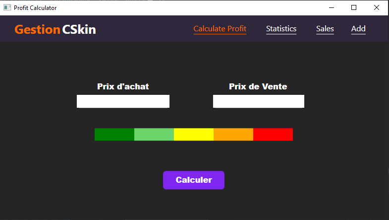
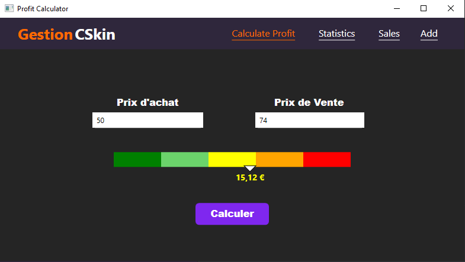
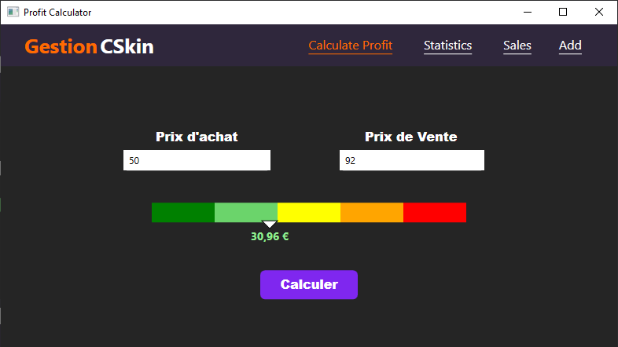
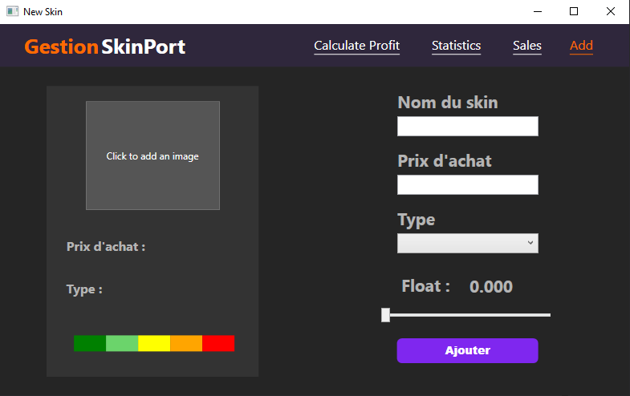
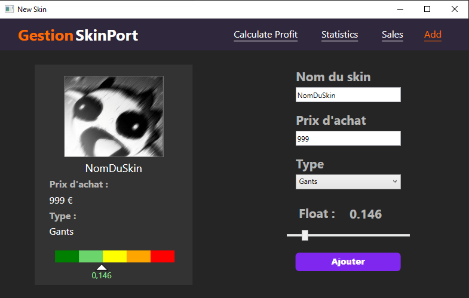

# GestionCSkin - Outil de gestion de skins CS2

Bienvenue sur GestionCSkin, un outil intuitif et riche en fonctionnalités conçu pour la gestion efficace des skins CS2. L'application offre aux utilisateurs la possibilité de suivre et de gérer leur inventaire de skins, de calculer leurs profits et d'obtenir des informations précieuses sur leurs activités de trading.

## Fonctionnalités Clés 🌟

- **Calcul de Profit 💸**: Déterminez vos gains potentiels en entrant le prix d'achat et de vente de vos skins. Notre outil calcule automatiquement le profit en tenant compte des taux de commission de SkinPort : 12% pour les ventes inférieures à 1000 € ou les ventes publiques, et 6% pour les ventes supérieures à 1000 € ou les transactions privées.

- **Gestion de l'Inventaire de Skins 🗂️**: Ajoutez facilement des skins à votre portefeuille avec des détails tels que le nom, le prix et la catégorie. Gardez votre collection organisée et accessible en un coup d'œil.

- **Statistiques Complètes 📊**: Restez informé grâce à un tableau de bord qui affiche les achats totaux, les ventes totales et la valeur actuelle des skins actifs. Surveillez votre performance de trading et prenez des décisions éclairées.

- **Tri par Catégorie 📑**: Filtrez et triez vos skins par leurs catégories respectives, vous permettant de naviguer aisément dans votre inventaire.

GestionCSkin est construit avec la communauté à l'esprit, offrant une plateforme centralisée pour gérer efficacement vos skins CS2. Que vous soyez un trader occasionnel ou un collectionneur aguerri, GestionCSkin est le compagnon idéal pour vous aider à rester à la pointe du marché CS:GO.

## Aperçus de l'Application

### Page Principale
[...]

### Calculateur de Profit 
*Cette capture d'écran montre l'interface du calculateur de profit dans son état par défaut, prêt à ce que l'utilisateur entre les prix d'achat et de vente.*



*Dans cet exemple, l'utilisateur a entré un prix d'achat et de vente, et le profit calculé est affiché, positionnant la flèche sur la barre de couleur selon la marge de profit.*



*Une autre instance du calculateur de profit avec des valeurs différentes, démontrant comment l'outil s'adapte pour afficher des profits plus élevés.*



### Statistique
[...]

### Ventes
[...]

### Ajout d'un Nouveau Skin

*Cette image illustre l'écran d'ajout d'un nouveau skin avec tous les champs réinitialisés, prêts pour la saisie des informations du nouveau skin par l'utilisateur.*



*Ici, nous voyons l'écran après qu'un utilisateur ait rempli les détails pour ajouter un nouveau skin, y compris le nom, le type, le prix et le float, avec un aperçu visuel du skin.*




## Installation 🔧

[...]

## Utilisation 🛠️

[...]

## Architecture du Projet 🏗️

```
GestionCSkin/
│
├── src/
│   │
│   ├── Converters/
│   │     FloatPositionConverter.cs
│   │     ImagePathConverter.cs
│   │     ProfitColorConverter.cs
│   │
│   ├── Model/
│   │     Skin.cs          # Entité principale
│   │     SkinType.cs      # Types de skins
│   │     SkinService.cs   # Gestion JSON
│   │
│   ├── ViewModels/
│   │     BaseViewModel.cs    # Core MVVM
│   │     RelayCommand.cs     # Commandes
│   │     MainWindowViewModel.cs
│   │     NewSkinViewModel.cs
│   │
│   └── Views/
│         MainWindow.xaml     # Vue principale
│         NewSkin.xaml        # Formulaire d'ajout
│         ProfitCalculator.xaml
│
├── Config/
│     App.config
│     packages.config
│
└── skins.json                 # Base de données des skins

**Éléments clés** :
- Architecture MVVM 
- Persistance JSON (SkinService) 
- Convertisseurs UI pour images/profit/float 
- Workflow complet : Ajout ➔ Stockage ➔ Affichage
```

## Tests 🧪

[...]
